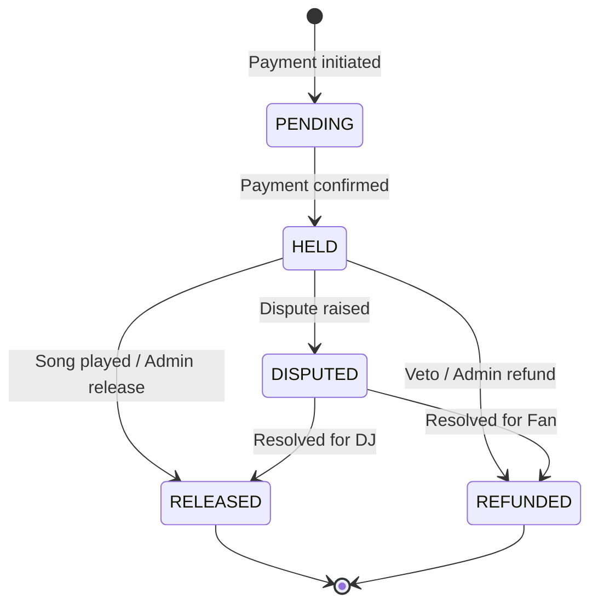

# Design Document: Admin CRM Production-Ready

## Overview

This design document outlines the backend implementation required to make the Admin CRM production-ready. The frontend (AdminCRM.tsx) and GraphQL service functions already exist. This design focuses on:

1. Extending the GraphQL schema with admin types, queries, and mutations
2. Creating AppSync resolvers with admin authorization
3. Extending DynamoDB tables and creating new tables for disputes/payouts
4. Implementing Lambda functions for complex operations (refunds, payouts)

## Architecture

```mermaid
graph TB
    subgraph "Frontend (Existing)"
        AdminCRM[AdminCRM.tsx]
        GraphQLService[graphql.ts Service]
    end
    
    subgraph "AWS AppSync"
        Schema[GraphQL Schema]
        Resolvers[VTL Resolvers]
        AuthDirective[@aws_auth directive]
    end
    
    subgraph "AWS Cognito"
        UserPool[User Pool]
        AdminGroup[Admins Group]
    end
    
    subgraph "AWS DynamoDB"
        UsersTable[Users Table]
        TransactionsTable[Transactions Table]
        DisputesTable[Disputes Table]
        PayoutsTable[Payouts Table]
    end
    
    subgraph "AWS Lambda"
        ProcessRefund[processRefund]
        ProcessPayout[processPayout]
    end
    
    AdminCRM --> GraphQLService
    GraphQLService --> Schema
    Schema --> Resolvers
    Resolvers --> AuthDirective
    AuthDirective --> AdminGroup
    Resolvers --> UsersTable
    Resolvers --> TransactionsTable
    Resolvers --> DisputesTable
    Resolvers --> PayoutsTable
    Resolvers --> ProcessRefund
    Resolvers --> ProcessPayout
```

## Components and Interfaces

### 1. GraphQL Schema Extensions

Add to `infrastructure/schema.graphql`:

```graphql
# Admin Types
type AdminStats {
  totalDJs: Int!
  activeDJs: Int!
  totalFans: Int!
  activeFans: Int!
  totalTransactions: Int!
  heldFunds: Float!
  releasedToday: Float!
  pendingPayouts: Float!
  openDisputes: Int!
  platformRevenue: Float!
  platformRevenueToday: Float!
}

type AdminUser {
  userId: ID!
  email: String!
  name: String!
  role: UserRole!
  tier: UserTier!
  status: UserStatus!
  totalSpent: Float
  totalEarnings: Float
  totalRequests: Int!
  totalEvents: Int
  rating: Float
  createdAt: AWSTimestamp!
  lastActiveAt: AWSTimestamp
  verificationStatus: VerificationStatus
}

type AdminUserConnection {
  items: [AdminUser!]!
  nextToken: String
}

type AdminTransaction {
  transactionId: ID!
  requestId: ID!
  userId: ID!
  userName: String!
  performerId: ID!
  performerName: String!
  eventId: ID!
  eventName: String
  songTitle: String!
  artistName: String!
  amount: Float!
  platformFee: Float!
  performerEarnings: Float!
  status: EscrowStatus!
  paymentProvider: PaymentProvider!
  providerTransactionId: String!
  createdAt: AWSTimestamp!
  releasedAt: AWSTimestamp
  refundedAt: AWSTimestamp
}

type AdminTransactionConnection {
  items: [AdminTransaction!]!
  nextToken: String
}

type Dispute {
  disputeId: ID!
  transactionId: ID!
  raisedBy: DisputeRaiser!
  raisedById: ID!
  raisedByName: String!
  reason: DisputeReason!
  description: String!
  status: DisputeStatus!
  priority: DisputePriority!
  assignedTo: String
  resolution: String
  createdAt: AWSTimestamp!
  updatedAt: AWSTimestamp!
  resolvedAt: AWSTimestamp
}

type DisputeConnection {
  items: [Dispute!]!
  nextToken: String
}

type Payout {
  payoutId: ID!
  performerId: ID!
  performerName: String!
  amount: Float!
  transactionCount: Int!
  status: PayoutStatus!
  bankName: String!
  accountNumber: String!
  reference: String!
  createdAt: AWSTimestamp!
  processedAt: AWSTimestamp
  failureReason: String
}

type PayoutConnection {
  items: [Payout!]!
  nextToken: String
}

# Enums
enum UserStatus {
  ACTIVE
  SUSPENDED
  PENDING_VERIFICATION
  FLAGGED
}

enum VerificationStatus {
  PENDING
  VERIFIED
  REJECTED
}

enum EscrowStatus {
  PENDING
  HELD
  RELEASED
  REFUNDED
  DISPUTED
}

enum DisputeRaiser {
  FAN
  DJ
}

enum DisputeReason {
  SONG_NOT_PLAYED
  WRONG_SONG
  POOR_QUALITY
  EXCESSIVE_WAIT
  PAYMENT_ISSUE
  OTHER
}

enum DisputeStatus {
  OPEN
  INVESTIGATING
  ESCALATED
  RESOLVED
}

enum DisputePriority {
  LOW
  MEDIUM
  HIGH
  URGENT
}

enum PayoutStatus {
  PENDING
  PROCESSING
  COMPLETED
  FAILED
}

# Admin Queries (require Admins group)
extend type Query {
  getAdminStats: AdminStats @aws_auth(cognito_groups: ["Admins"])
  listAllUsers(role: String, limit: Int, nextToken: String): AdminUserConnection @aws_auth(cognito_groups: ["Admins"])
  listAllTransactions(status: String, limit: Int, nextToken: String): AdminTransactionConnection @aws_auth(cognito_groups: ["Admins"])
  listAllDisputes(status: String, limit: Int, nextToken: String): DisputeConnection @aws_auth(cognito_groups: ["Admins"])
  listAllPayouts(status: String, limit: Int, nextToken: String): PayoutConnection @aws_auth(cognito_groups: ["Admins"])
}

# Admin Mutations (require Admins group)
extend type Mutation {
  updateUserStatus(userId: ID!, status: String!, reason: String): AdminUser @aws_auth(cognito_groups: ["Admins"])
  releaseEscrowFunds(transactionId: ID!): AdminTransaction @aws_auth(cognito_groups: ["Admins"])
  refundTransaction(transactionId: ID!, reason: String!): AdminTransaction @aws_auth(cognito_groups: ["Admins"])
  resolveDispute(disputeId: ID!, resolution: String!, action: String!): Dispute @aws_auth(cognito_groups: ["Admins"])
  processAdminPayout(payoutId: ID!): Payout @aws_auth(cognito_groups: ["Admins"])
}
```

### 2. AppSync Resolver Configuration

Create VTL resolvers in `infrastructure/resolvers/admin/`:

#### Query Resolvers

**getAdminStats.req.vtl**
```vtl
## Scan multiple tables and aggregate stats
#set($result = {})
$util.toJson({
  "version": "2018-05-29",
  "operation": "Invoke",
  "payload": {
    "action": "getAdminStats"
  }
})
```

**listAllUsers.req.vtl**
```vtl
#set($limit = $util.defaultIfNull($ctx.args.limit, 50))
#set($filter = {})
#if($ctx.args.role)
  #set($filter.role = { "eq": $ctx.args.role })
#end

{
  "version": "2018-05-29",
  "operation": "Scan",
  "limit": $limit,
  #if($ctx.args.nextToken)
  "nextToken": "$ctx.args.nextToken",
  #end
  #if($filter.size() > 0)
  "filter": $util.toJson($filter)
  #end
}
```

**listAllTransactions.req.vtl**
```vtl
#set($limit = $util.defaultIfNull($ctx.args.limit, 50))
#set($filter = {})
#if($ctx.args.status)
  #set($filter.status = { "eq": $ctx.args.status })
#end

{
  "version": "2018-05-29",
  "operation": "Scan",
  "limit": $limit,
  #if($ctx.args.nextToken)
  "nextToken": "$ctx.args.nextToken",
  #end
  #if($filter.size() > 0)
  "filter": $util.toJson($filter)
  #end
}
```

#### Mutation Resolvers

**updateUserStatus.req.vtl**
```vtl
{
  "version": "2018-05-29",
  "operation": "UpdateItem",
  "key": {
    "userId": $util.dynamodb.toDynamoDBJson($ctx.args.userId)
  },
  "update": {
    "expression": "SET #status = :status, updatedAt = :updatedAt",
    "expressionNames": {
      "#status": "status"
    },
    "expressionValues": {
      ":status": $util.dynamodb.toDynamoDBJson($ctx.args.status),
      ":updatedAt": $util.dynamodb.toDynamoDBJson($util.time.nowEpochSeconds())
    }
  }
}
```

**releaseEscrowFunds.req.vtl**
```vtl
{
  "version": "2018-05-29",
  "operation": "UpdateItem",
  "key": {
    "transactionId": $util.dynamodb.toDynamoDBJson($ctx.args.transactionId)
  },
  "update": {
    "expression": "SET #status = :status, releasedAt = :releasedAt",
    "expressionNames": {
      "#status": "status"
    },
    "expressionValues": {
      ":status": $util.dynamodb.toDynamoDBJson("RELEASED"),
      ":releasedAt": $util.dynamodb.toDynamoDBJson($util.time.nowEpochSeconds())
    }
  }
}
```

### 3. DynamoDB Table Extensions

#### Users Table - Add Attributes
```json
{
  "AttributeDefinitions": [
    { "AttributeName": "userId", "AttributeType": "S" },
    { "AttributeName": "role", "AttributeType": "S" },
    { "AttributeName": "status", "AttributeType": "S" }
  ],
  "GlobalSecondaryIndexes": [
    {
      "IndexName": "role-status-index",
      "KeySchema": [
        { "AttributeName": "role", "KeyType": "HASH" },
        { "AttributeName": "status", "KeyType": "RANGE" }
      ],
      "Projection": { "ProjectionType": "ALL" }
    }
  ]
}
```

New attributes to add:
- `status` (String): ACTIVE, SUSPENDED, PENDING_VERIFICATION, FLAGGED
- `totalSpent` (Number): Aggregate spending for fans
- `totalEarnings` (Number): Aggregate earnings for DJs
- `totalRequests` (Number): Count of requests made/received
- `totalEvents` (Number): Count of events for DJs
- `rating` (Number): Average rating for DJs
- `lastActiveAt` (Number): Epoch timestamp
- `verificationStatus` (String): PENDING, VERIFIED, REJECTED

#### Transactions Table - Add Attributes
```json
{
  "AttributeDefinitions": [
    { "AttributeName": "transactionId", "AttributeType": "S" },
    { "AttributeName": "status", "AttributeType": "S" }
  ],
  "GlobalSecondaryIndexes": [
    {
      "IndexName": "status-createdAt-index",
      "KeySchema": [
        { "AttributeName": "status", "KeyType": "HASH" },
        { "AttributeName": "createdAt", "KeyType": "RANGE" }
      ],
      "Projection": { "ProjectionType": "ALL" }
    }
  ]
}
```

New attributes:
- `platformFee` (Number): 10% of amount
- `performerEarnings` (Number): 90% of amount
- `status` (String): PENDING, HELD, RELEASED, REFUNDED, DISPUTED
- `releasedAt` (Number): Epoch timestamp
- `refundedAt` (Number): Epoch timestamp
- `userName` (String): Denormalized for display
- `performerName` (String): Denormalized for display
- `eventName` (String): Denormalized for display

#### New Disputes Table
```json
{
  "TableName": "BeatMatchMe-Disputes",
  "KeySchema": [
    { "AttributeName": "disputeId", "KeyType": "HASH" }
  ],
  "AttributeDefinitions": [
    { "AttributeName": "disputeId", "AttributeType": "S" },
    { "AttributeName": "status", "AttributeType": "S" },
    { "AttributeName": "createdAt", "AttributeType": "N" }
  ],
  "GlobalSecondaryIndexes": [
    {
      "IndexName": "status-createdAt-index",
      "KeySchema": [
        { "AttributeName": "status", "KeyType": "HASH" },
        { "AttributeName": "createdAt", "KeyType": "RANGE" }
      ],
      "Projection": { "ProjectionType": "ALL" }
    }
  ]
}
```

#### New Payouts Table
```json
{
  "TableName": "BeatMatchMe-Payouts",
  "KeySchema": [
    { "AttributeName": "payoutId", "KeyType": "HASH" }
  ],
  "AttributeDefinitions": [
    { "AttributeName": "payoutId", "AttributeType": "S" },
    { "AttributeName": "performerId", "AttributeType": "S" },
    { "AttributeName": "status", "AttributeType": "S" }
  ],
  "GlobalSecondaryIndexes": [
    {
      "IndexName": "performerId-index",
      "KeySchema": [
        { "AttributeName": "performerId", "KeyType": "HASH" }
      ],
      "Projection": { "ProjectionType": "ALL" }
    },
    {
      "IndexName": "status-index",
      "KeySchema": [
        { "AttributeName": "status", "KeyType": "HASH" }
      ],
      "Projection": { "ProjectionType": "ALL" }
    }
  ]
}
```

## Data Models

### AdminStats Aggregation
```typescript
interface AdminStats {
  totalDJs: number;        // Count Users where role=PERFORMER
  activeDJs: number;       // Count Users where role=PERFORMER AND status=ACTIVE
  totalFans: number;       // Count Users where role=AUDIENCE
  activeFans: number;      // Count Users where role=AUDIENCE AND status=ACTIVE
  totalTransactions: number; // Count Transactions
  heldFunds: number;       // Sum amount where status=HELD
  releasedToday: number;   // Sum amount where status=RELEASED AND releasedAt=today
  pendingPayouts: number;  // Sum amount from Payouts where status=PENDING
  openDisputes: number;    // Count Disputes where status!=RESOLVED
  platformRevenue: number; // Sum platformFee from all transactions
  platformRevenueToday: number; // Sum platformFee where createdAt=today
}
```

### Transaction Flow States


## Error Handling

### Authorization Errors
- Return `UnauthorizedError` if caller is not in Admins group
- Log unauthorized access attempts for security monitoring

### Data Validation Errors
- Validate userId exists before status update
- Validate transactionId exists and is in correct state before escrow operations
- Validate disputeId exists and is not already resolved

### Payment Provider Errors
- Wrap refund operations in try-catch
- Store failure reason in transaction record
- Implement retry logic for transient failures

### Error Response Format
```typescript
interface AdminError {
  errorType: 'UNAUTHORIZED' | 'NOT_FOUND' | 'INVALID_STATE' | 'PAYMENT_FAILED';
  message: string;
  details?: Record<string, any>;
}
```

## Testing Strategy

### Unit Tests
- Test VTL resolver templates with mock data
- Test Lambda functions with mocked DynamoDB and payment provider

### Integration Tests
- Test GraphQL queries/mutations against local DynamoDB
- Test authorization with mock Cognito tokens

### E2E Tests
- Test admin login flow
- Test user suspension/activation
- Test escrow release/refund
- Test dispute resolution workflow
- Test payout processing

### Security Tests
- Verify non-admin users cannot access admin endpoints
- Verify admin operations are logged
- Test for SQL injection in search queries
